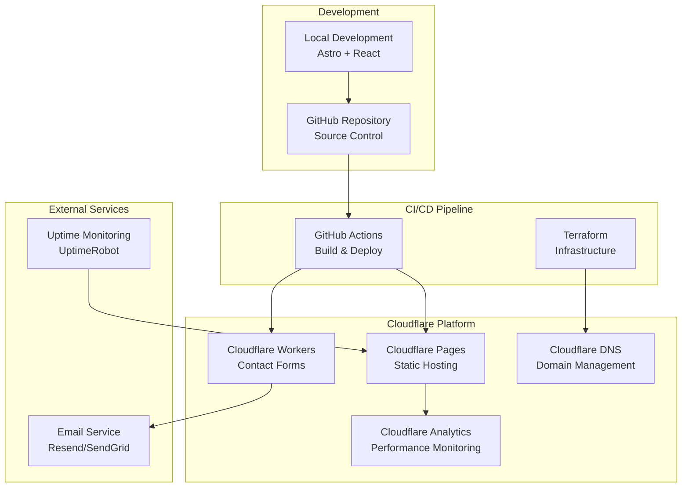

# Design Document

## Overview

The consulting website modernization transforms Steve Leve's static GitHub Pages site into a modern, dynamic web application using Astro + React hosted on Cloudflare Pages. The architecture prioritizes rapid deployment to production while incorporating modern DevOps practices for learning and long-term maintainability.

The design follows a phased approach: immediate production deployment with core functionality, followed by infrastructure-as-code implementation and advanced features. This ensures the urgent business need is met while providing opportunities to learn Terraform, monitoring, and other DevOps technologies.

## Architecture

### High-Level Architecture



### Deployment Strategy

**Phase 1: Rapid Production Deployment (Week 1)**
- Astro project setup with React components
- Content migration from static site
- Cloudflare Pages deployment via Wrangler CLI
- Contact form with Cloudflare Workers
- GitHub Actions for automated deployment

**Phase 2: Infrastructure as Code (Week 2)**
- Terraform modules for Cloudflare resources
- Environment-specific configurations
- Remote state management
- Infrastructure monitoring

**Phase 3: Advanced Features (Future)**
- Headless CMS integration (Keystatic or Sanity)
- Client authentication area
- Advanced analytics and monitoring

## Components and Interfaces

### Frontend Application (Astro + React)

**Technology Stack:**
- Astro 4.x for static site generation and routing
- React 18 for interactive components
- TypeScript for type safety
- Tailwind CSS for styling (maintaining current design system)
- Vite for build tooling and development server

**Component Architecture:**
```
src/
├── components/
│   ├── layout/
│   │   ├── Header.astro
│   │   ├── Footer.astro
│   │   └── Navigation.tsx
│   ├── ui/
│   │   ├── Card.tsx
│   │   ├── Button.tsx
│   │   └── ContactForm.tsx
│   └── sections/
│       ├── Hero.astro
│       ├── ServicePillars.astro
│       └── CaseStudies.astro
├── pages/
│   ├── index.astro
│   ├── services.astro
│   ├── case-studies.astro
│   ├── about.astro
│   └── contact.astro
├── content/
│   ├── services/
│   ├── case-studies/
│   └── config.ts
└── styles/
    └── global.css
```

**Key Design Decisions:**
- Astro for optimal performance with islands architecture
- React components only where interactivity is needed
- Content collections for structured data management
- Responsive design maintaining current Material Design inspiration

### Backend Services (Cloudflare Workers)

**Contact Form Handler:**
```typescript
// Worker API Structure
interface ContactFormData {
  name: string;
  email: string;
  company?: string;
  message: string;
  subject: 'consultation' | 'employment' | 'general';
}

interface EmailTemplate {
  to: string;
  from: string;
  subject: string;
  html: string;
  text: string;
}
```

**Worker Responsibilities:**
- Form validation and sanitization
- Rate limiting and spam protection
- Email formatting and delivery
- Response logging for analytics
- CORS handling for cross-origin requests

### Infrastructure Components

**Cloudflare Resources:**
- Pages project for static hosting
- Workers for serverless functions
- DNS zones for domain management
- Analytics for performance monitoring
- Security rules for protection

**Terraform Module Structure:**
```
terraform/
├── modules/
│   ├── cloudflare-pages/
│   ├── cloudflare-workers/
│   └── cloudflare-dns/
├── environments/
│   ├── development/
│   ├── staging/
│   └── production/
└── shared/
    ├── variables.tf
    └── outputs.tf
```

## Data Models

### Content Structure

**Service Definition:**
```typescript
interface Service {
  id: string;
  title: string;
  description: string;
  icon: string;
  features: string[];
  cta: {
    text: string;
    href: string;
  };
}
```

**Case Study Definition:**
```typescript
interface CaseStudy {
  id: string;
  title: string;
  client: string;
  industry: string;
  challenge: string;
  solution: string;
  results: string[];
  technologies: string[];
  publishedDate: Date;
  featured: boolean;
}
```

**Contact Inquiry:**
```typescript
interface ContactInquiry {
  id: string;
  timestamp: Date;
  name: string;
  email: string;
  company?: string;
  subject: string;
  message: string;
  source: 'website' | 'referral';
  status: 'new' | 'responded' | 'closed';
}
```

### Configuration Management

**Environment Configuration:**
```typescript
interface EnvironmentConfig {
  environment: 'development' | 'staging' | 'production';
  domain: string;
  apiEndpoints: {
    contact: string;
    analytics: string;
  };
  features: {
    analytics: boolean;
    monitoring: boolean;
    cms: boolean;
  };
}
```

## Error Handling

### Frontend Error Handling

**Client-Side Errors:**
- Form validation with real-time feedback
- Network error recovery with retry mechanisms
- Graceful degradation for JavaScript failures
- User-friendly error messages with actionable guidance

**Implementation Strategy:**
```typescript
// Error boundary for React components
class ErrorBoundary extends React.Component {
  // Handle component errors gracefully
}

// Form submission error handling
const handleSubmit = async (data: ContactFormData) => {
  try {
    await submitForm(data);
  } catch (error) {
    if (error instanceof NetworkError) {
      // Show retry option
    } else if (error instanceof ValidationError) {
      // Show field-specific errors
    } else {
      // Show generic error with contact alternatives
    }
  }
};
```

### Backend Error Handling

**Worker Error Management:**
- Structured error logging with context
- Graceful fallbacks for external service failures
- Rate limiting with clear user feedback
- Security error handling without information disclosure

**Error Response Format:**
```typescript
interface ErrorResponse {
  success: false;
  error: {
    code: string;
    message: string;
    details?: Record<string, any>;
  };
  timestamp: string;
  requestId: string;
}
```

### Infrastructure Error Handling

**Deployment Failures:**
- Automatic rollback on failed deployments
- Health checks before traffic routing
- Notification system for deployment issues
- Manual intervention procedures documented

**Monitoring and Alerting:**
- Uptime monitoring with multiple global locations
- Performance threshold alerts
- Error rate monitoring with automated responses
- Infrastructure drift detection and remediation

## Testing Strategy

### Frontend Testing

**Unit Testing:**
- Jest for utility functions and business logic
- React Testing Library for component testing
- Coverage requirements: 80% for critical paths

**Integration Testing:**
- Playwright for end-to-end user flows
- Contact form submission workflows
- Cross-browser compatibility testing
- Mobile responsiveness validation

**Performance Testing:**
- Lighthouse CI in GitHub Actions
- Core Web Vitals monitoring
- Bundle size analysis and optimization
- Image optimization validation

### Backend Testing

**Worker Testing:**
- Miniflare for local Worker development
- Unit tests for form processing logic
- Integration tests with email services
- Load testing for contact form endpoints

**Infrastructure Testing:**
- Terraform plan validation in CI
- Infrastructure compliance scanning
- Security configuration testing
- Disaster recovery procedures

### Deployment Testing

**Staging Environment:**
- Full production simulation
- User acceptance testing workflows
- Performance benchmarking
- Security penetration testing

**Production Monitoring:**
- Real user monitoring (RUM)
- Synthetic transaction monitoring
- Error tracking and alerting
- Performance regression detection

## Security Considerations

### Frontend Security

**Content Security Policy:**
- Strict CSP headers for XSS prevention
- Trusted source allowlisting
- Inline script restrictions
- Regular security header auditing

**Data Protection:**
- Client-side input sanitization
- Secure form submission protocols
- Privacy-compliant analytics
- Cookie consent management

### Backend Security

**Worker Security:**
- Input validation and sanitization
- Rate limiting and DDoS protection
- Secure environment variable management
- CORS policy enforcement

**Email Security:**
- SPF, DKIM, and DMARC configuration
- Email content sanitization
- Bounce and complaint handling
- Secure API key management

### Infrastructure Security

**Cloudflare Security:**
- WAF rules for common attacks
- Bot management and filtering
- SSL/TLS certificate management
- Access control for admin functions

**Secrets Management:**
- GitHub Secrets for CI/CD variables
- Cloudflare environment variables for Workers
- Terraform state encryption
- Regular secret rotation procedures

## Performance Optimization

### Frontend Performance

**Build Optimization:**
- Code splitting for optimal loading
- Image optimization and lazy loading
- CSS purging and minification
- JavaScript tree shaking

**Runtime Performance:**
- Astro islands for minimal JavaScript
- React component optimization
- Efficient state management
- Memory leak prevention

### Backend Performance

**Worker Optimization:**
- Cold start minimization
- Efficient request processing
- Caching strategies for static data
- Database connection pooling (future)

### Infrastructure Performance

**CDN Configuration:**
- Global edge caching
- Optimal cache headers
- Compression algorithms
- Regional performance optimization

**Monitoring and Optimization:**
- Real-time performance metrics
- Automated performance alerts
- Regular performance audits
- Continuous optimization workflows