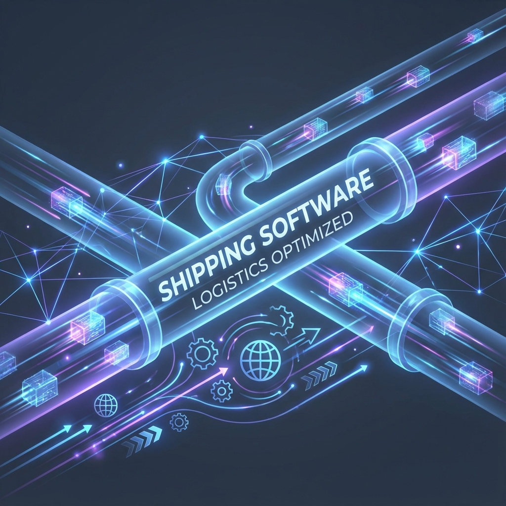

# About Me

## From Retail Software Innovation to Product Engineering to Platform Leadership

I've spent 25+ years solving problems across the full spectrum of technology work—from pioneering CD-ROM distribution platforms in the pre-broadband era, to designing user-facing features that millions use daily, to keeping revenue-critical infrastructure running during crises, to introducing AI responsibly in enterprise environments.

What sets me apart isn't mastery of a single domain. It's the ability to flex between product innovation, client services, infrastructure, leadership, and emerging technologies—often simultaneously—while maintaining focus on what actually matters: delivering value and solving real problems.

---

## The Early Years: Learning the Craft (1997-2008)

### Aztech New Media Corporation (1997-2000)
**Pioneering Retail Software Distribution**

Before broadband was ubiquitous, getting software to consumers meant retail CD-ROM packages in major stores. I joined Aztech's "Cube Team" as a New Media Developer, curating collections of demo and shareware software for retail distribution.

**The innovation:** I led our small team of 4 developers in evolving from copy-paste-change coding to an XML-driven launcher platform. This seemingly simple change transformed our workflow—we went from code changes between every product release to simple configuration file updates, dramatically simplifying QA and accelerating time-to-market.

This was my first experience with **reusable systems thinking**—solving a class of problems once rather than solving each instance individually. The principle would guide my work for the next 25 years.

**What I learned:**
- Early product development and go-to-market strategies
- Working in small, fast-moving teams
- Creating reusable technical solutions that improve team velocity
- Mentorship from more experienced developers on advanced projects
- The importance of simplifying repetitive processes

The business model wouldn't survive the internet era, so I moved to opportunities in the emerging online space.

---

### Harp Advertising + Interactive (2001-2008)
**Full-Service Agency & Client Solutions**

As Lead Software Developer at a full-service agency, I led a small team of 3 developers creating ecommerce, CRM, CMS, email marketing, surveys, and custom applications for diverse clients spanning shipping, manufacturing, fine art, and education.

**Notable projects:**

**Illy Coffee E-Commerce** — Customized AbleCommerce web store (CFML + SQL Server) integrating with membership and subscription management ERP backend. Complex integration work requiring deep understanding of both systems.

**AllMetal Inc. B2B Platform** — Created public website with extensive parts catalog for B2B customers plus intranet application for order management integrated with legacy mainframe system (ASP.NET, SQL Server). Learned to bridge modern web platforms with legacy enterprise systems.

**Harp Survey Tool** — Led design of white-label market survey platform with visual designer enabling customers to create surveys with advanced controls and branching logic (CFML + SQL Server). Product design experience requiring both technical implementation and UX thinking.

**Noble Network of Charter Schools** — Delivered CMS solution for 7+ school sites using DotNetNuke, ASP.NET, and SQL Server. Each school on separate domain, centralized management.

**Internal Time Tracking & Billing System** — Designed internal project management and client billing system from scratch (CFML + SQL Server). Real-world exposure to the business side of software services.

**What I learned:**
- Full-stack development across multiple technology platforms
- Client communication and managing technical/business expectations
- Database design and SQL Server administration (achieved test-ready knowledge)
- .NET framework and ASP.NET in depth
- Design patterns and best practices in fast-paced environments
- Technical sales support and RFP preparation
- The difference between agency projects and product development

**Why I left:** Wanted to work on larger-scale products with iterative growth in a more mature environment. Short-term agency projects were becoming routine—I wanted to build something that would evolve over years, not months.

---

### Bean Products (2003-2006)
**Independent Contractor — Business Process Automation**

While at Harp, I took on independent consulting work for a manufacturing & drop-shipping company making yoga supplies and hypoallergenic pillows. This was hands-on exposure to how physical products actually get made and shipped.

**The challenge:** Multiple sales channels with manual order processing and fulfillment workflows consuming significant staff time and creating opportunities for errors.

**The solution:** Incrementally automated the complete order workflow using Visual Basic for Applications (VBA) and VB6 to orchestrate:
- Extracting order details from email
- Batch upload to MYOB accounting and inventory management
- Integration with UPS WorldShip for fulfillment
- Optimized shipping cost calculations

**What made this valuable:**

I worked directly in the manufacturing office and spent time on the production floor. I saw the complete lifecycle—product development, production, packing, shipping. I watched how automation directly freed office staff for higher-value work.

**What I learned:**
- End-to-end understanding of physical product business operations
- How to prioritize work by impact (tackle the most time-consuming and error-prone processes first)
- Agile approach to automation (incremental value delivery)
- The importance of seeing your work's impact firsthand
- How to identify and deprioritize low-value, high-effort tasks
- Real-world constraints of small business operations

This experience shaped my understanding that technology serves business outcomes—automation isn't about replacing people, it's about enabling them to do more valuable work.

---

## The Product Years: Building What People Actually Use (2008-2017)

I joined ShareASale in April 2008 as the second engineering hire at a 10-person startup. The founder and CEO (Brian Littleton) had built the business for 7 years with CTO (Mike Littleton) before deciding to expand the engineering team.

For nearly a decade, I led the development of many of the features that defined the platform and drove its growth from scrappy startup to one of the largest and most distinguished affiliate networks in the United States.

**The environment:** We didn't have product owners, agile coaches, or an ops team. We were tightly integrated with support and sales, monitored ticket systems and error logs directly. Customers and senior staff drove product design—we were responsive with highly effective solutions and quick fixes. This earned us a strong reputation for customer focus.

**Notable creations:**

**Tags & Baskets (2011)** — What started as a simple categorization tool became the centerpiece of the platform's attribution and reporting system. Over 100,000 users created 250,000+ tags organizing 4.8 million items. The system continues finding new applications 14 years later—a testament to designing flexible, extensible systems.

**Affiliate Recruitment Tool (2016)** — A full SaaS CRM feature enabling advertisers to prospect and connect with publishers. Built personalized messaging with macro systems, automated notifications triggered by performance thresholds. Achieved exceptional adoption: 1,000+ monthly users sending 5,000+ connection requests.

**Product Discovery Tool (2014)** — Enabled publishers to create affiliate links while browsing any merchant site. Injected a managed iframe with authentication and program status detection. Provided seamless workflow with social media and website integration. Adoption doubled year-over-year from 2014-2018.

**Newsletter System Overhaul (2014)** — Complete redesign with open rate and bounce tracking, advanced search, mailing list management, HTML editing with preview, integrated product and banner search with macro injection, split campaigns, comprehensive analytics. Scale: 650 average users sending 1.7K newsletters to 1.6M monthly recipients (peak: 2M monthly messages).

**Generation 6 (2011) & Generation 7 (2016-2017) UX Overhauls** — Led comprehensive site-wide interface modernizations serving all platform users. Designed lightweight, reusable component frameworks for advanced UI controls. Created customizable home page experiences, dynamic graphs, activity feeds, and improved reporting systems.

**Affiliate Aquarium Social Platform (2010)** — Delivered comprehensive internal SaaS social media application with user groups, blogging, events, mail, private messaging, permissions, invitations, activity streams, and notifications. Complete social platform built from scratch.

**Bulk Upload Tools (2015)** — Created comprehensive workflow automation framework enabling enterprise-scale operations. Bulk tagging of partners, mass upload of promotional offers and transactions. Streamlined complex business processes reducing manual overhead.

**Merchant Setup Wizard (2015)** — Implemented improved onboarding wizard with staging area for accounts in signup process. Accelerated completion rates while reducing abandonment and support overhead.

**What made this work valuable:**

I didn't just write code. I worked directly with customers, support teams, and executives to understand needs and design solutions. I owned the full product lifecycle—from concept through deployment to measuring adoption and impact.

This wasn't just feature development. It was **product thinking, user experience design, and understanding what drives business value.**

**The technical debt challenge:**

With 7 years of growth before I joined, considerable technical debt existed in both code and infrastructure. Despite strong customer focus, engineering rigor was lacking. Our small team (only 3 engineers) prioritized feature development while neglecting sustainable practices—a friction I noticed early as a productivity drain and worked actively to correct.

I couldn't raise the engineering bar significantly back then, but mastered what I could control. I studied software architecture and DevOps best practices, I applied that knowledge where possible despite headwinds. Through this experience I learned to see the impact of technical debt and how to manage it pragmatically while shipping continuously.  

**Why I stayed despite stagnation:**

ShareASale under Brian's leadership was a singular experience, his sincerity and authenticity were (and are) truly inspirational. The company culture was excellent and enabled me to spend time with my young family, including my daughter with developmental disabilities. I prioritized my family's health over professional growth opportunities. The stagnation in team growth and legacy tech stack signaled it was time to move on, but ongoing family health and wellbeing struggles made active career development very difficult. 

---

## The Crisis Years: When Everything Changed (2018-2020)

**2017: The Acquisition**

ShareASale was acquired by Awin (then Affiliate Window & Zanox), a large amalgamation of European affiliate marketing networks. The parent company was still forming through M&A, undergoing tremendous organizational change.

Compounding the complexity: NTT, hosting our legacy physical infrastructure, was closing the data center hosting our primary server infrastructure.

**January 2018: Sudden Technical Leadership**

The founding CTO transitioned out with minimal knowledge transfer. I suddenly became the technical steward of an entire enterprise platform serving thousands of merchants and generating millions in transactions.

My roadmap had been focused on known technical debt in software architecture and database schema. Those concerns took a backseat when my scope expanded to include infrastructure and a looming data center closure in 12 months.

With Awin undergoing massive organizational changes, there was no capacity, support, or budget to help. With one remaining engineer, I began work in earnest to reverse-engineer the enterprise and prepare for migration.

**March 2018: Data Center Catastrophic Failure**

Mere weeks after assuming technical leadership, our worst-case scenario happened:

- Triple-redundant power systems failed
- Backup systems didn't engage  
- Battery backups were overdue for replacement
- Automated failover failed (API credentials expired with departing CTO)

**Response:** I manually executed emergency DNS failover to our disaster recovery facility in Texas, recovered missing RAID volumes on the primary HP ProLiant database server without data loss, and restored full service availability in **24 minutes**.

Revenue protected. Trust maintained. Crisis leadership under extreme pressure during the most vulnerable transition period.

**2018-2020: Infrastructure Modernization Under Constraints**

**Legacy Infrastructure Assessment:**
- Reverse-engineered and documented 13 physical Windows servers (2008/2012) across multiple data centers
- Established version control over unmanaged code, scripts, and configuration
- Created documentation where none existed

**Data Center Migration Leadership (January 2019):**
- Executed complex physical-to-physical (p2p), physical-to-virtual (p2v), and virtual-to-virtual (v2v) transformations
- Coordinated with multiple vendors during weekend migration window
- Designed and executed disaster recovery strategy using secondary site

**Infrastructure Consolidation:**
- Reorganized and separated overloaded services
- Eliminated single points of failure
- Replaced hard-coded passwords with Active Directory service accounts
- Added storage clusters, separated database volumes for performance
- Replaced internal FTP with secured SMB shares
- Improved network security posture

**Database & Performance Optimization:**
- Managed primary SQL Server 2012 instances with ~3TB data across 4-5 RAID volumes operating at capacity
- Implemented performance tuning under severe resource constraints
- Developed migration strategies for virtualization
- Established backup and recovery procedures (Veritas backup solution was unusable)

**Operational Excellence & Automation:**
- Established universal version control for all enterprise code, configuration, scripts
- Implemented configuration management using PowerShell remoting (no budget for proper tools)
- Created comprehensive monitoring and alerting reducing incident response time by 75%

**Compliance & Security:**
- ISO 27001 Compliance: Modernized authentication implementing NIST 800-63B requirements
- Google Certification Protection: Led response to policy changes protecting $4M annual revenue (20% of revenue stream)
- Implemented Google ReCAPTCHA and Enzoic API for credential stuffing protection

**Pandemic Leadership (2020):**
- Led successful transition to 100% remote work achieving record growth with zero system downtime
- Maintained team productivity and system reliability during global disruption
- Implemented remote access security controls

**What this period taught me:**

I didn't choose to become an infrastructure expert. The business needed someone to step into the vacuum, and I was the person who could. So I learned disaster recovery, vendor management, compliance frameworks, crisis communication.

The skills I developed during this period—remaining calm under pressure, making decisions with imperfect information, protecting business continuity—became defining characteristics of my leadership approach.

---

## The Transformation Years: Building for the Future (2021-2023)

**2021-2022: AWS Cloud Migration**

Led comprehensive migration from hybrid on-premise infrastructure to AWS cloud with aggressive 6-month timeline. Zero downtime during migration of real-time transaction processing systems handling $1B+ annual transactions.

**Achievement:** Featured in AWS case study.

**Team Building & Engineering Excellence (2021-2023):**

Built and scaled globally distributed engineering teams during rapid growth phase:
- Recruited across United States and internationally (2 cloud engineers in Brazil)
- Collaborated with EU counterparts across UK, Germany, Italy, Poland, Romania
- Designed comprehensive role descriptions for critical positions
- Redesigned onboarding processes reducing new hire ramp time by 50%
- Managed transition from co-located office to fully remote, globally distributed team

**DevOps & Engineering Maturity Transformation:**

- **Increased deployment frequency** while achieving **90% reduction in change failure rate**
- Migrated from SVN with ad-hoc deployment tools to GitLab with comprehensive CI/CD pipelines
- Implemented tag-based deployments to multiple environments with automated testing
- Established mandatory code review processes through GitLab security controls
- Transitioned from long-lived Windows EC2 instances to containerized solutions in AWS EKS
- Standardized DevOps tooling enabling rapid creation of new microservices and experimentation with modern languages (Rust)

**Cost Optimization:**
- **25% AWS reduction** through systematic right-sizing and architectural improvements
- **50% DataDog reduction** through log filtering and sampling strategies
- Maintained 99.95%+ uptime during optimization

**Engineering Maturity Initiatives (2022-2023):**

- **Email Systems Modernization:** Implemented comprehensive email security (SPF, DKIM, DMARC). Operated 3 mail domains sending 1M+ monthly messages with improved deliverability.

- **Observability Platform Consolidation:** Migrated from LogicMonitor & NewRelic to consolidated DataDog platform. Integrated OpsGenie for escalation and on-call rotation management. Introduced SLOs and response policies. **Improved incident response time by 40%**—most incidents acknowledged within 15 minutes, resolved within 1 hour.

- **Shopify Integration Rearchitecture:** Modernized business-critical application for compliance and high availability. Established GitOps workflow and comprehensive observability.

- **Fraud & Security Service Development:** Designed holistic fraud detection microservice protecting revenue and reputation. Incrementally displaced legacy applications using modern MFE+BFF (micro-frontend + backend for frontend) patterns.

**Organizational Challenges:**

Navigated complex organizational dynamics during leadership transitions and budget constraints. Managed team through adversarial management relationships while maintaining technical excellence. Advocated for engineering best practices despite organizational resistance. Maintained team morale during uncertain acquisition integration period.

---

## The Platform Consolidation Years (2023-2025)

**Principal Architect — Enterprise Integration**

Co-developed enterprise migration strategies consolidating real-time mission-critical systems following Awin Global acquisition. Protected vital revenue streams while aligning globally distributed teams across code, infrastructure, and compliance domains.

**Major Integration Projects:**

**Awin Platform Upgrade Initiative (2024-2025):**
- Principal technical contributor merging customers, platforms, and teams across organizations
- Solved complex, high-impact, high-risk integration challenges spanning multiple technology stacks
- Collaborated with Awin engineering teams on customer migration, feature mapping, infrastructure consolidation
- Technologies: Akamai, AWS, Cloudflare Edge Workers, DataDog, DataBricks, JavaScript, TypeScript, C#, Java

**Fee Processing Architecture Modernization (2023):**
- Designed comprehensive fee processing architecture to displace disparate legacy applications
- Improved account funding subsystem performance through decoupled microservices design
- Implemented using React, AWS EKS, SQS, SNS, Lambda with MFE+BFF pattern

**Infrastructure Cost Optimization:**
- Reduced observability platform costs by **50%**
- Reduced infrastructure costs by **25%**
- Systematic right-sizing and waste elimination initiatives

**Security & Compliance Leadership:**
- Served as Security Ambassador, mentoring teams on best practices
- Increased developer satisfaction by **25%** through engineering enablement initiatives

---

## The AI Years: Governance & Integration (2024-2025)

**AI Ambassador & Governance (2024-2025):**

Served on AI governance steering group providing policy recommendations during organizational uncertainty about AI adoption.

**Achievements:**
- Documented productivity savings based on DX metrics
- Achieved **200%+ velocity improvement** for early adopters
- Established responsible AI governance frameworks balancing innovation with security and quality
- Early adopter of AI development tools (GitHub Copilot, Claude Code, Cursor, others)

**Current Work — Fractional CTO:**

Providing technical leadership for stealth MarTech startup:
- Shipped beta product to early customers with positive feedback
- Architecture decisions, code review, infrastructure strategy
- 2x weekly meetings plus async guidance
- Team enablement and technical mentoring

**Recent Portfolio — Production AI Applications:**

Built 3 RAG demo systems in December 2025 including 2 live public demos. Custom evaluation framework achieving measurable quality improvements (+15% precision, +22% overall quality). Multi-platform deployment (Vercel, Cloudflare Workers). Full-stack integration with authentication, rate limiting, cost controls.

**What matters more than the specific AI work:**

I understand how to introduce emerging technologies responsibly. I've lived through enough hype cycles to know the difference between demos that impress and systems that ship. I know how to establish governance frameworks that enable productivity while managing risk.

---

## What This All Means

**I'm a generalist who goes deep when needed.**

I've pioneered retail software distribution in the pre-internet era. I've designed user experiences for millions of users. I've recovered from catastrophic infrastructure failures in under 30 minutes. I've led teams through acquisitions, migrations, and transformations. I've introduced AI governance frameworks while achieving measurable productivity gains.

**I connect technical decisions to business outcomes.**

Every architectural choice protects revenue or enables growth. Every feature serves users or operators. Every process improvement reduces toil or accelerates delivery. Every governance framework balances innovation with responsible risk management.

**I thrive in ambiguity and crisis.**

When founders leave, data centers fail, or organizations undergo massive change—I bring clarity, calm, and pragmatic solutions. I've stepped into leadership vacuums repeatedly and delivered results under pressure.

**I learn what the business needs me to learn.**

Started in retail software distribution. Learned agency client work. Mastered product engineering. Learned infrastructure when the business needed it. Learned cloud when migration became critical. Learning AI because that's where value is being created now.

**I stay hands-on while thinking strategically.**

I'm equally comfortable writing code, reviewing architecture, mentoring engineers, and communicating with executives. I can debug a performance issue at 2 AM and present technology strategy to a board of directors the next afternoon.

**I've built reusable systems for 25+ years.**

From XML-driven launchers at Aztech, to order automation at Bean Products, to platform features serving millions at ShareASale, to cloud migration strategies—I solve classes of problems, not individual instances.

---

## Background & Credentials

**17 Years | ShareASale/Awin Global (2008-2025)**
Built and scaled affiliate marketing infrastructure serving 250K+ publishers, 10K+ merchants, $1B+ annual transactions. Led platform consolidations, zero-downtime migrations, crisis response, team building, and digital transformations.

**7 Years | Harp Advertising + Interactive (2001-2008)**
Lead Software Developer delivering full-stack solutions for diverse clients. Gained client communication skills, full-stack expertise, and understanding of business-driven development.

**3 Years | Bean Products (2003-2006)**
Independent contractor automating business operations. Learned end-to-end product lifecycle, impact-driven prioritization, and value of seeing work's direct impact.

**3 Years | Aztech New Media Corporation (1997-2000)**
New Media Developer pioneering retail software distribution. Developed reusable systems thinking and early product development experience.

**Technical Breadth:**
- Retail Software Innovation (1997-2000): CD-ROM distribution, XML-driven platforms
- Client Services & Agency Work (2001-2008): Full-stack development, client communication
- Product Engineering (2008-2017): User-facing features, UX design, full product lifecycle
- Infrastructure & Operations (2018-2020): Data center migrations, disaster recovery, system reliability
- Cloud & DevOps (2021-2023): AWS migration, CI/CD, observability, containerization
- Platform Consolidation (2023-2025): Enterprise integration, global team coordination
- AI Integration (2024-2025): Governance, productivity tools, application development

**Current Focus:**
- Fractional CTO for stealth MarTech startup
- AI application development and evaluation
- Exploring modern development workflows and agentic coding

**Certifications:**
- AWS Certified AI Practitioner (2025-2028)
- AWS Certified Cloud Practitioner (expired 2022)

**Education:**
- B.A., Studio Art — Western Illinois University
- Technical Theatre background (WESTEC audio-visual support)
- Self-directed learning: Software architecture, DevSecOps, AI/ML, leadership

---

## What Colleagues Say

Over 25+ years across multiple organizations, I've been consistently recognized for:

**Technical Excellence** — Solving complex problems others couldn't, from XML-driven platforms to disaster recovery to platform consolidations

**Reliability** — The person you want on-call when something breaks at 3 AM

**Collaboration** — Working effectively across teams, disciplines, and organizations (US, UK, EU, Brazil)

**Mentorship** — Helping junior engineers grow and succeed through hands-on guidance

**Calm Under Pressure** — Bringing clarity to crisis situations, from data center failures to organizational upheaval

**User Focus** — Building what actually matters, not just what's technically interesting

**Systems Thinking** — Solving classes of problems rather than individual instances

**Servant Leadership** — My ability to flex between product engineering, infrastructure, leadership, and emerging technologies made me invaluable during organizational transitions. My disposition and servant leadership approach earned trust and respect from colleagues at all levels.

---

## Beyond Work

**Family first.** Married with college-age children. Family includes members with disabilities requiring ongoing support—this shaped my understanding of sustainable work practices and work-life balance. Having experienced massive overtime and burnout myself, I'm uniquely focused on team morale, safety, and sustainable workload.

**Creative roots.** B.A. in Studio Art and Technical Theatre from Western Illinois University. Worked in audio-visual technical services supporting professional performers (concerts, musicals, dance, theatre). These creative foundations inform my approach to user experience and problem-solving. Interest in game design and interactive experiences continues.

**Continuous learner.** Built extensive library on software architecture during crisis years with no training budget. Watched conference talks, studied vendor documentation, learned through teaching others. Systematic self-directed learning approach across 25+ years. Studied SQL Server DBA and ASP.NET/C# certification tracks. Pursued AI/ML foundations during governance work.

**Community focus.** Exploring ways to contribute knowledge and experience to early-career engineers and teams facing similar transitions. Interested in technical writing and sharing crisis leadership lessons.

**Personal values:**
- Blame-free problem solving—take responsibility for team mistakes, focus on improving processes
- Assume positive intent from coworkers
- View excessive overtime as management failure, strive for sustainable stopping points
- Balance challenging growth with manageable stress
- Family relationships matter more than career advancement

---

## Currently

Based in the Chicago suburbs. Open to remote roles, consulting engagements, and collaborations with teams building interesting things.

I'm particularly interested in:

**AI Engineering roles** combining infrastructure thinking with modern AI capabilities

**Technical leadership positions** (CTO, VP Engineering, Principal Engineer) where strategic thinking and hands-on execution both matter

**Companies navigating digital transformations or platform consolidations** where my 25-year pattern of stepping into complexity and delivering results adds value

**Organizations valuing:**
- Flexibility and systems thinking over narrow specialization
- Servant leadership and collaborative culture
- Sustainable work practices and work-life balance
- Learning and continuous improvement
- Business outcomes over technical perfection

What I bring isn't just technical skills—it's 25 years of successfully navigating change, crisis, and complexity while delivering business value, developing people, and maintaining the bigger picture of what actually matters.

---

[Get in Touch](https://stevenleve.com/contact/) · [LinkedIn](https://linkedin.com/in/steve-leve)

**Portfolio:**
- [Live AI Demos](https://vercel-rag-demo.stevenleve.com) (recent work)
- [GitHub](https://github.com/sleve) (code examples)
- Case Studies (coming soon)