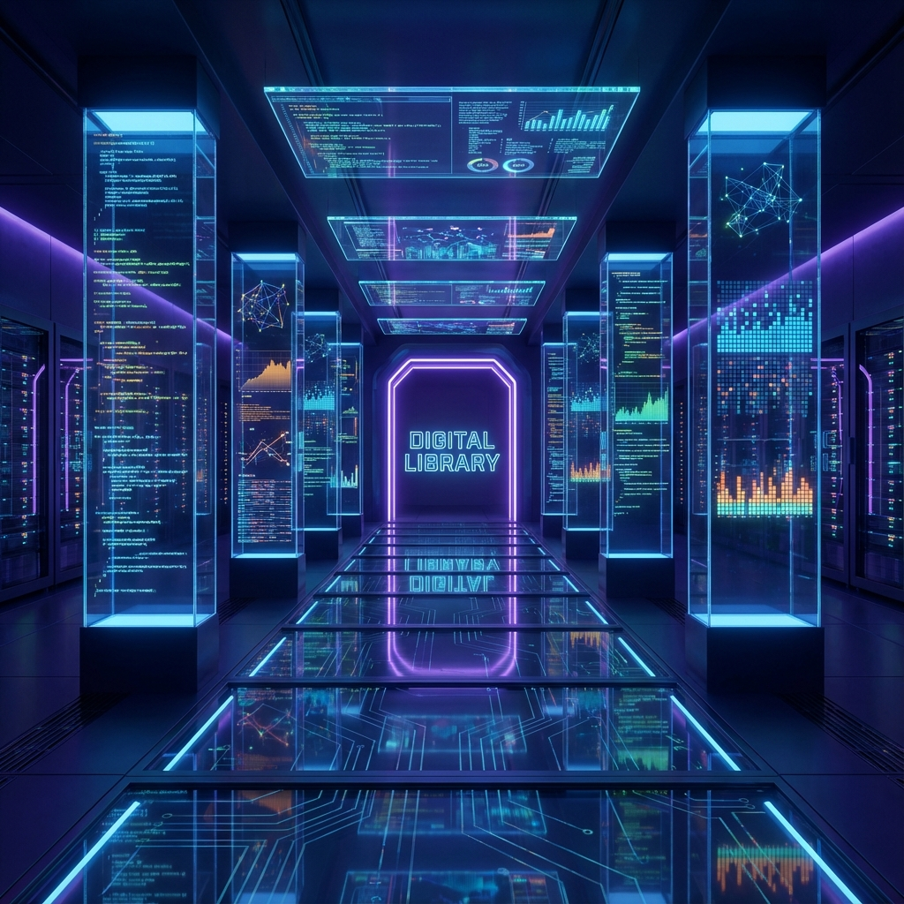

# Case Studies

> **Delivering Results Across the Stack:** From AI applications shipping in days to zero-downtime cloud migrations protecting billions in transactions. 25+ years of turning complex technical challenges into measurable business outcomes.

---

## AI Application Development

### [Production RAG Systems: Multi-Platform Experimental Lab](case-studies/production-rag-systems.md)

**Challenge:** Building deployable AI consulting capabilities requires more than theoretical knowledge—clients need consultants who can deploy immediately on diverse platforms, evaluate trade-offs with data, and optimize systematically.

**What I Built:** Multi-platform RAG experimental unit enabling systematic comparison of AI architectures, platforms, and techniques. Created production-ready implementations on Vercel, Cloudflare Workers, and local Jupyter environments as controlled labs for evaluating cost, performance, and quality trade-offs. Built with simple, open-source stack to maintain proximity to fundamentals—providing perspective when evaluating higher-abstraction platforms like AWS Bedrock or Azure AI Foundry.

**Key Results:**
- **2 live production demos** ([Vercel](https://vercel-rag-demo.stevenleve.com), [Cloudflare](https://cloudflare-rag-demo.stevenleve.com)) showcasing different architectural approaches
- **Custom evaluation framework** with ground-truth curation for systematic improvement
- **Measured optimization:** +15% Precision (reranking), +22% quality (semantic chunking), +18% NDCG (hybrid search)
- **Platform comparison insights:** 90%+ cost reduction possible, informed hosting recommendations
- **~5,000+ lines** production-quality code with reusable patterns for rapid client deployment

**Value Proposition:** Demonstrates balanced mastery of **Accuracy** (engineering trade-offs), **Precision** (measured optimization), and **Speed** (efficient development)—the foundations for effective AI consulting.

[Read full case study →](case-studies/production-rag-systems.md)

---

### [AI-Augmented Development: 2-3x Velocity Gains](case-studies/ai-augmented-development.md)

**Challenge:** Organizations investing in AI coding assistants often see disappointing returns due to lack of systematic evaluation and context engineering.

**Approach:** Evaluated 10+ AI development tools across different task types, measuring actual productivity impact and developing reusable patterns.

**Key Results:**
- **Overall velocity:** 2-3x improvement for complex projects
- **Exploratory work:** 3-5x speedup
- **Refactoring:** 4-6x acceleration
- **Setup time reduction:** 60-70% through context patterns

[Read full case study →](case-studies/ai-augmented-development.md)

---

## Technical Leadership

### [Fractional CTO: Stealth MarTech Startup](case-studies/fractional-cto.md)

**Challenge:** Early-stage startup needed technical leadership for beta product launch but couldn't justify full-time executive hire during customer validation phase.

**My Role:** Fractional CTO providing strategic guidance, architecture reviews, and infrastructure decisions (10-15 hours/week).

**Key Results:**
- **Beta product launched** on schedule to early customers
- **Positive initial feedback** validating product-market fit
- **Technical foundation** established for scaling
- **Part-time engagement** maintained during job search

[Read full case study →](case-studies/fractional-cto.md)

---

### [Platform Consolidation at Scale: $100M+ Revenue Protected](case-studies/platform-consolidation.md)

**Challenge:** Following acquisition, consolidate 250,000 publishers and 10,000 merchants onto global platform while protecting $100M+ annual revenue and decades of custom features.

**My Role:** Principal Architect leading technical strategy and critical system integrations across 15-team, multi-year program.

**Key Results:**
- **98% revenue protected** through targeted feature parity
- **260K accounts migrated** with 85% acceptance rate
- **250M monthly requests** handled at 263ms latency
- **Zero customer re-integration** required

[Read full case study →](case-studies/platform-consolidation.md)

---

## Cloud Strategy & Cost Optimization

### [Infrastructure Cost Reduction: $20K Monthly Savings](case-studies/cost-optimization.md)

**Challenge:** Infrastructure costs trending upward with sharp spike. Needed to eliminate waste without impacting performance or availability.

**Approach:** Data-driven analysis using AWS Trusted Advisor and DataDog cost analytics to identify low-risk, high-impact optimizations.

**Key Results:**
- **$20,000 monthly savings** sustained ($240K annualized)
- **25% AWS reduction** maintaining 99.95%+ uptime
- **50% DataDog reduction** without degrading observability
- **75% log volume reduction** improving signal-to-noise

[Read full case study →](case-studies/cost-optimization.md)

---

### [Edge Computing: 90%+ Cost Reduction + Enterprise Security](case-studies/edge-computing.md)

**Challenge:** Build professional website requiring enterprise security and global performance at near-zero running costs.

**Approach:** Architect serverless application on Cloudflare edge platform with defense-in-depth security.

**Key Results:**
- **19% → 96% security score** (77 point improvement, F → A+)
- **97/100 Lighthouse performance** with sub-100ms global latency
- **$5/month** production costs (90%+ reduction vs. traditional)
- **Zero cold starts** (<1ms vs. Lambda multi-second)

[Read full case study →](case-studies/edge-computing.md)

---

## Legacy System Modernization & Migration

### [AWS Cloud Migration: Zero Downtime, Six Months](case-studies/aws-migration.md)

**Challenge:** Managed hosting provider became bottleneck. Leadership approved AWS migration with 6-month deadline and zero tolerance for revenue disruption.

**Approach:** Hybrid lift-and-shift strategy with targeted modernization, comprehensive observability migration.

**Key Results:**
- **Zero downtime** for revenue-generating systems
- **100% infrastructure** migrated in 6 months
- **4 data centers → 1 cloud platform**
- **400%+ deployment frequency** increase through automation

[Read full case study →](case-studies/aws-migration.md)

---

### [Data Center Emergency: From Disaster to Virtualized in 12 Months](case-studies/data-center-emergency.md)

**Challenge:** Primary data center closing in 12 months. 20 undocumented servers across 4 locations. No budget for consultants. Existential business risk.

**Approach:** Reverse-engineered infrastructure using PowerShell, automated replication, phased VMware migration.

**Key Results:**
- **12 physical servers → VMware** in <12 months
- **Zero revenue loss** during migration
- **Existential risk eliminated**
- **Foundation created** for future cloud migration

[Read full case study →](case-studies/data-center-emergency.md)

---

## Marketing Technology

### [Affiliate Recruitment Tool: 40K Monthly Invitations, $10M Impact](case-studies/affiliate-recruitment.md)

**Challenge:** Merchants needed CRM-like capabilities to recruit affiliate partners at scale with performance incentives and streamlined communication.

**Solution:** Built comprehensive merchant-facing platform with staff administration console.

**Key Results:**
- **3,300 monthly active users**
- **40,000+ monthly invitations** sent
- **5 million messages** over 10-year lifecycle
- **$10M/year publisher commissions** on $100M+ conversions

[Read full case study →](case-studies/affiliate-recruitment.md)

---

### [Tracking System: 250M Monthly Requests, 263ms Latency](case-studies/tracking-system.md)

**Challenge:** Revenue-critical tracking system needed to remain functional during platform consolidation while appearing unchanged to 250K+ publisher integrations.

**Solution:** Multi-layer reverse proxy architecture (Cloudflare Workers + AWS Lambda) enabling seamless transition.

**Key Results:**
- **250M monthly requests** handled seamlessly
- **263ms average latency** maintained
- **99.5% revenue protection** achieved
- **75% error rate reduction**

[Read full case study →](case-studies/tracking-system.md)

---

## What This Demonstrates

**AI Engineering:**
- Production systems shipping in days, not months
- Evaluation rigor differentiating from tutorial-based developers
- Multi-platform deployment demonstrating architectural flexibility
- 2-3x velocity gains through systematic AI augmentation

**Technical Leadership:**
- Active fractional CTO work with beta product launched
- Multi-year, 15-team platform consolidation protecting $100M+ revenue
- Strategic thinking combined with hands-on architecture

**Cloud & Cost Optimization:**
- $20K monthly savings without performance impact
- 90%+ cost reduction through edge computing
- Enterprise security (96% score) at consumer prices

**Legacy Modernization:**
- Zero-downtime cloud migrations at scale
- Emergency data center exit under resource constraints
- Pragmatic modernization protecting business continuity

**Marketing Technology:**
- 17 years building affiliate marketing infrastructure
- Revenue-critical systems at massive scale (250M requests/month)
- Deep understanding of tracking, attribution, payments

---

## Let's Talk About Your Challenge

Every case study above started with a problem that seemed insurmountable—and became a solution that delivered measurable results.

What's your challenge?

**Get in Touch:** [Contact Page](https://stevenleve.com/contact/) · [LinkedIn](https://linkedin.com/in/steve-leve)

**Live Demos:**
- [Vercel RAG Demo](https://vercel-rag-demo.stevenleve.com) — Production chatbot with semantic search
- [Cloudflare RAG Demo](https://cloudflare-rag-demo.stevenleve.com) — Edge-deployed with on-device inference

---

**Last Updated:** December 2025