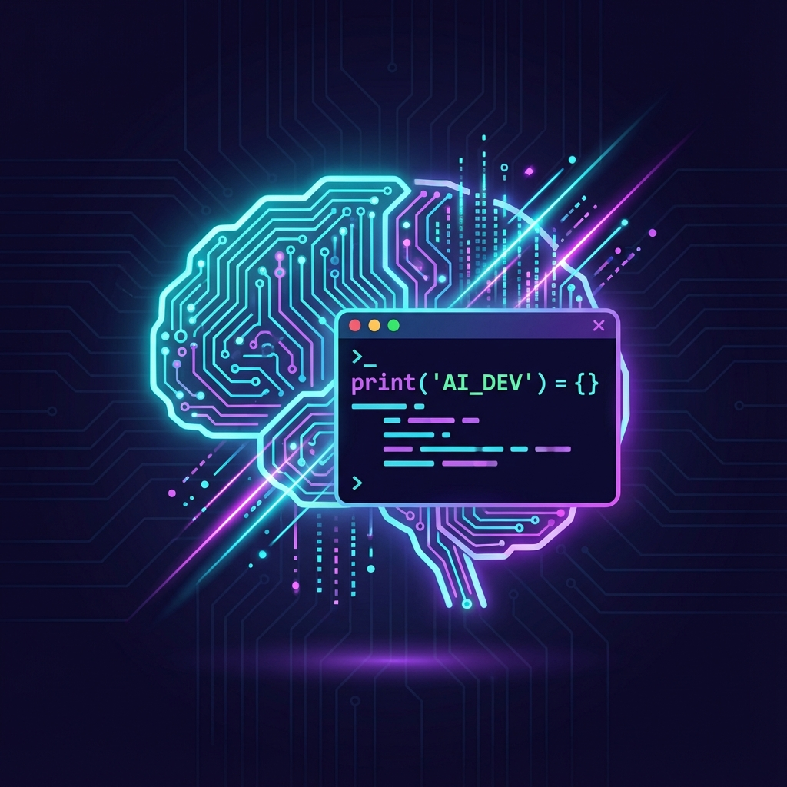

# Services

I work with companies that need senior technical capability without the overhead of a full-time executive hire—or help teams build high-quality AI applications at scale using modern workflows.

---

## AI Application Development

**From prototype to production.**

Most AI demos don't survive contact with real users. I build applications with the reliability, observability, and operational maturity that production demands.

**What I deliver:**
- Production RAG systems with sub-second latency and streaming responses
- Multi-LLM architectures (OpenAI, Anthropic, open-source models)
- Custom evaluation frameworks that measure quality, not just vibes
- Platform-flexible deployment (Vercel, Cloudflare Workers, AWS)
- Full-stack integration with authentication, rate limiting, cost controls

**Recent work:** RAG Evaluation Framework series of projects for cross platform comparison of agentic RAG applications under different conditions, configuration and constraints for the purpose of comparatative analysis of quality, performance, and cost. Built custom evaluation framework achieving +15% precision improvement through systematic testing and measurement.

**Evidence:**
- [Vercel RAG Demo](https://vercel-rag-demo.stevenleve.com) — Production chatbot with semantic search (live)
- [Cloudflare RAG Demo](https://cloudflare-rag-demo.stevenleve.com) — Edge-deployed with on-device LLM inference (live)
- ~5,000+ lines of production Python and TypeScript
- Custom metrics framework (not RAGAS) with ground-truth datasets

*Best for: Teams building AI features who need someone who's shipped production AI applications, not just completed tutorials.*

[View Details →](./services/ai-application-development.md)

---

## Technical Leadership

**Strategic guidance without the full-time commitment.**

Fractional CTO and advisory services for companies navigating technical complexity. I help with the decisions that are hard to undo—architecture choices, team structure, technology bets.

**What I offer:**
- Fractional CTO / interim technical leadership
- Architecture review and technology strategy
- Engineering team mentoring and growth planning
- Enterprise architecture and roadmap development
- Technical due diligence for M&A or investment

**Current engagement:** Serving as Fractional CTO for stealth MarTech startup—shipped beta product to early customers with positive feedback. 2x weekly meetings plus async code review and strategic guidance.

**Background:** 17+ years leading technical teams through acquisitions, migrations, and transformations. Scaled engineering teams, established governance & DevSecOps frameworks, led AI adoption initiatives.

*Best for: Startups needing senior technical leadership, companies in transition, or teams facing architectural decisions with long-term consequences.*

[View Details →](./services/technical-leadership.md)

---

## Marketing Technology

**Deep expertise in revenue-critical MarTech infrastructure.**

17 years building affiliate marketing platforms at ShareASale/Awin Global. I understand tracking, attribution, payments, and the systems that power performance marketing at scale.

**What I know:**
- Affiliate and partner marketing platform architecture
- Tracking systems and attribution (250M+ monthly requests)
- Transaction processing and payment systems ($1B+ annual volume)
- Publisher/merchant relationship management at scale
- AI opportunities in MarTech (attribution, optimization, intelligence)

**Track record:** Built one of the largest and most popular affiliate platforms serving 250K+ publishers and 10K+ merchants. Led platform consolidations protecting 99.5% of revenue. Designed tracking integrations with 263ms latency improvement and 75% error rate reduction.

**Current work:** Fractional CTO for stealth MarTech startup focused on partner ecosystem management.

*Best for: MarTech companies building affiliate, partner, or advertising platforms—or anyone acquiring/integrating marketing technology assets.*

[View Details →](./services/martech-consulting.md)

---

## Cloud Strategy & Cost Optimization

**Stop paying for resources you don't need.**

Data-driven cloud optimization reducing costs without compromising performance or reliability. I've delivered 25% AWS reduction and 50% DataDog reduction in production environments.

**What I deliver:**
- Cloud cost optimization assessment (identify 20-40% waste)
- Observability & logging strategy (reduce costs, improve signal)
- Edge computing evaluation (Cloudflare Workers, Vercel, AWS, CDN, edge inference)
- AI & LLM cost optimization (model selection, caching, edge inference)
- Cloud governance & security (compliance, FinOps, cost controls)

**Proven results:**
- 25% AWS infrastructure cost reduction while maintaining 99.95%+ uptime
- 50% DataDog reduction while improving observability
- $20,000+ monthly sustained savings
- Recent edge computing work: 90%+ cost reduction for suitable AI workloads

**Modern expertise:** Edge computing (Cloudflare Workers), AI cost optimization, FinOps practices, infrastructure as code (Terraform).

*Best for: Companies spending $10K+/month on cloud with suspected waste, teams exploring edge computing, or anyone building AI features with unpredictable costs.*

[View Details →](./services/cloud-strategy.md)

---

## Legacy System Modernization & Migration

**From legacy to modern, without breaking what works.**

Pragmatic modernization that protects your business while unlocking new capabilities. 25+ years experience with zero-downtime migrations and incremental refactoring.

**What I deliver:**
- Legacy system assessment & modernization roadmap
- Cloud migration (AWS) with zero-downtime strategies
- Monolith to microservices decomposition (when appropriate)
- Technology stack upgrades (ColdFusion, legacy .NET, older Java → modern stacks)
- AI integration into legacy systems (add AI value without rewriting everything)

**Innovation:** AI-augmented modernization achieving 2-3x development velocity through agentic coding tools (Claude Code, GitHub Copilot, Kiro). 4-6x acceleration on refactoring through AI assistance.

**Track record:**
- Zero-downtime AWS migration planned and executed in 6 months
- Multi-year platform consolidation, gap analysis, risk mitigation
- 99.95%+ uptime maintained throughout transformations
- ColdFusion → Node.js migrations, legacy .NET → modern .NET
- Ad-hoc deployments to GitOps CI/CD release train
- Stabilization through Site-Reliability Engineering principles

*Best for: Companies with critical legacy systems that need modernization, but business continuity is non-negotiable. Organizations open to AI-augmented development for faster delivery.*

[View Details →](./services/legacy-modernization.md)

---

## How I Work

**Engagements typically start with a conversation** to understand what you're trying to accomplish and whether I'm the right fit. I'm direct about what I can and can't help with.

**Flexibility matters.** Some clients need a few hours of architecture review. Others need embedded leadership for months. I structure engagements around outcomes, not billable hours.

**I'm also open to full-time roles** for the right opportunity—particularly AI Engineering positions where I can combine my infrastructure background with production AI development, or CTO/VP Engineering roles for companies building interesting things.

---

## Recent Portfolio Work

**December 2025 — AI Application Development Sprint:**

Shipped production ready RAG evaluation systems demonstrating AI platform capabilities:

1. **[Vercel RAG Demo](https://vercel-rag-demo.stevenleve.com)** (Live)
   - Full-stack chatbot with semantic search
   - Next.js 16, React 19, OpenAI GPT-4o, Neon PostgreSQL (pgvector)
   - Sub-second streaming responses across 100+ document corpus
   - Production-ready with authentication and rate limiting

2. **[Cloudflare Workers RAG Demo](https://cloudflare-rag-demo.stevenleve.com)** (Live)
   - Edge-deployed RAG using Cloudflare Workers AI 
   - Optimized for global latency (~100ms worldwide)
   - Demonstrates 90%+ cost reduction vs. traditional cloud
   - Vectorize embeddings DB with D1, KV, & R2 for document, keyword, and chunk storage.  

3. **[RAG Quality Evaluation Lab](https://github.com/SteveLeve/rag_wiki_demo)** (GitHub)
   - Jupyter-based experimentation framework
   - Custom metrics (Precision@K, Recall, MRR, NDCG)
   - Ground-truth dataset curation methodology
   - Achieved +15% precision, +22% overall quality through systematic testing

**Technical Evidence:**
- ~5,000+ lines of production Python and TypeScript
- Advanced RAG patterns: reranking, query expansion, hybrid search, semantic chunking
- Multi-platform deployment demonstrating architectural flexibility
- Evaluation rigor differentiating from tutorial-based developers

**Current Engagement:**
- Fractional CTO for stealth MarTech startup (2024-present)
- Beta product shipped to early customers
- Technical strategy, code review, infrastructure decisions

---

## Credentials & Background

**Certifications:**
- AWS Certified AI Practitioner (active 2025-2028)
- AWS Certified Cloud Practitioner (expired 2022)

**Professional Experience:**
- **17+ Years | ShareASale/Awin Global** — Principal Software Engineer/Architect
  - Platform serving 250K+ publishers, 10K+ merchants, $1B+ annual transactions
  - Led acquisitions, platform consolidations, cloud migrations
  - Scaled engineering team 8 → 25+ engineers
  - AI Ambassador driving 200%+ velocity improvements

**Education:**
- B.A., Studio Art — Western Illinois University

**Location:** Chicago suburbs (remote-first preferred)

---

## Get in Touch

Ready to discuss your project or explore working together?

**Contact:** [Get in Touch](https://stevenleve.com/contact/) · [LinkedIn](https://linkedin.com/in/steve-leve)

**Portfolio:**
- [Vercel RAG Demo](https://vercel-rag-demo.stevenleve.com) (live)
- [Cloudflare RAG Demo](https://cloudflare-rag-demo.stevenleve.com) (live)
- [GitHub](https://github.com/sleve) (code examples)
- [Personal Website](https://stevenleve.com) (case studies, writing)

---

**Last Updated:** December 2025
