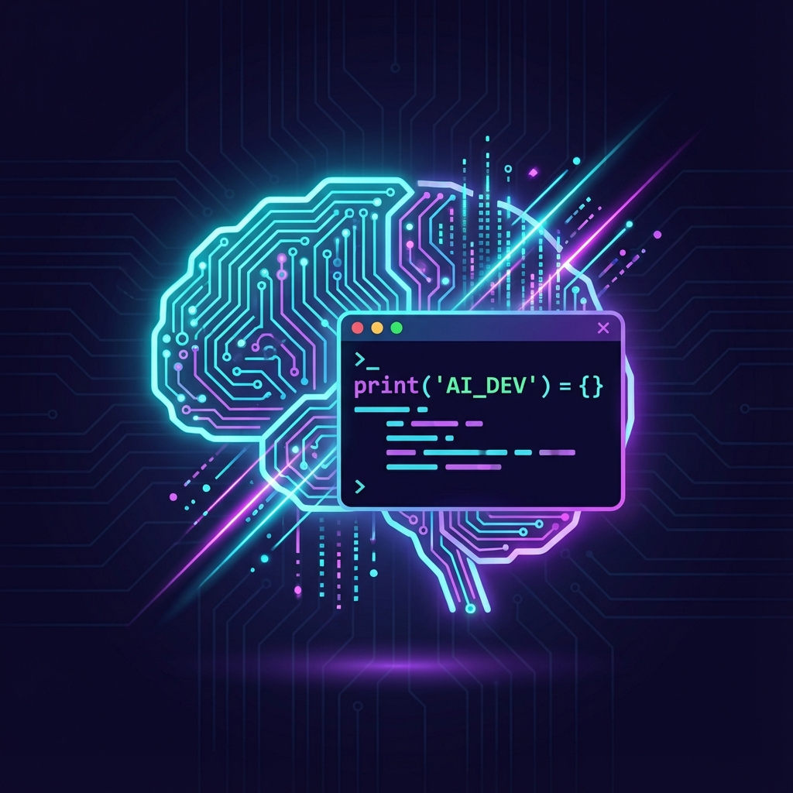

# What I Do

I'm a full-stack AI engineer. I build production software and the agentic development systems that build it: coding-agent harnesses, context engineering, knowledge architecture, agent memory, and verification workflows for AI-generated code.

---

## Full-Stack AI Engineering

**From prototype to production.**

Most AI demos don't survive contact with real users. I build AI products and features with the reliability, observability, and operational maturity that production demands.

**Shipped work:**
- Co-authored a customer-facing AI agent service (AWS Bedrock, LangChain, Temporal)
- Production RAG systems with sub-second latency and streaming responses (Vercel, Cloudflare Workers)
- Multi-LLM architectures (Anthropic, OpenAI, Gemini, open-source models)
- Custom evaluation frameworks that measure quality, not just vibes: Precision@K, MRR, NDCG, ground-truth datasets

**Evidence:**
- [Vercel RAG Demo](https://vercel-rag-demo.stevenleve.com) — Production chatbot with semantic search (live)
- [Cloudflare RAG Demo](https://cloudflare-rag-demo.stevenleve.com) — Edge-deployed with on-device LLM inference (live)
- Measured optimization: +15% precision, +22% overall quality through systematic evaluation

[View Details →](./services/ai-application-development.md)

---

## Agentic Development Systems

**I build the systems that build the software.**

Agent-driven development is an engineering discipline, not tool adoption. I engineer the harnesses, context, and verification that make it reliable at production stakes.

**Shipped work:**
- Multi-agent knowledge architecture with memory and skills: citation-backed architecture diagrams, idempotent integration test scripts
- Cross-harness agent synchronization: one source of truth for agents, skills, and rules shared by Cursor, GitHub Copilot, and Claude Code
- Semi-autonomous agent team at PartnershipTool: Cursor + Claude, Honcho for agent memory, Hermes agent orchestration
- Custom Claude Code agents, skills, plugins, and MCP servers

**Why it matters:** One engineer who has mastered agent-driven methods covers ground that used to take a team — with the verification discipline to trust the output.

---

## AI-Augmented Legacy Modernization

**From legacy to modern, without breaking what works.**

25+ years inside complex production systems, 17 of them at $1B+ transaction scale. I modernize legacy systems for a living — and now I do it AI-augmented.

**Shipped work:**
- Migrated legacy queue processors to the Temporal workflow engine using custom sub-agents to analyze and migrate legacy subsystems
- Zero-downtime AWS migration planned and executed in 6 months
- Multi-year platform consolidation protecting 98% of revenue: 260K accounts migrated, 250M monthly requests at 263ms latency
- ColdFusion → Node.js and legacy .NET → modern stack migrations; ad-hoc deployments → GitOps CI/CD

**Why it matters:** Legacy modernization is where agentic methods pay off most — sub-agents can exhaustively analyze entangled subsystems that would take humans months to map. The 25 years of scar tissue is what makes the agent output trustworthy.

[View Details →](./services/legacy-modernization.md)

---

## Current Work

**PartnershipTool — Cofounder & Full-Stack Engineer (Sep 2025-Present)**

Ad-tech business intelligence and partner management platform (Next.js, React, PostgreSQL, Stripe, PostHog). Built and shipped with an agent-driven workflow: Cursor + Claude, self-hosted Honcho for agent memory, Hermes as a semi-autonomous agent team.

---

## Credentials & Background

**Certifications:**
- AWS Certified AI Practitioner (active 2025-2028)
- AWS Certified Cloud Practitioner (expired 2022)

**Professional Experience:**
- **PartnershipTool** — Cofounder & Full-Stack Engineer (2025-present)
- **Origami Risk** — Senior Full Stack Engineer, Skunk Works Platform Team (2026)
- **17+ Years | ShareASale/Awin Global** — Senior Developer → Lead Architect → Principal Architect
  - Platform serving 250K+ publishers, 10K+ merchants, $1B+ annual transactions
  - Led acquisitions, platform consolidations, cloud migrations, AI adoption ($500K annualized savings)

**Education:**
- B.A. — Western Illinois University

**Location:** Chicago suburbs (remote-only)

---

## Get in Touch

I'm looking for senior IC roles on small, fast-moving, high-ownership teams working at the frontier of agent-driven development.

**Contact:** [Get in Touch](https://stevenleve.com/contact/) · [LinkedIn](https://linkedin.com/in/steve-leve)

**Portfolio:**
- [Vercel RAG Demo](https://vercel-rag-demo.stevenleve.com) (live)
- [Cloudflare RAG Demo](https://cloudflare-rag-demo.stevenleve.com) (live)
- [GitHub](https://github.com/SteveLeve) (code examples)
- [Case Studies](./case-studies.md)

---

**Last Updated:** July 2026

<!-- Retired detail pages (do not link from nav): services/technical-leadership.md, services/martech-consulting.md, services/cloud-strategy.md — consulting-services framing retired per messaging-core.md 2026-07. Historical content preserved in case-studies/. -->
