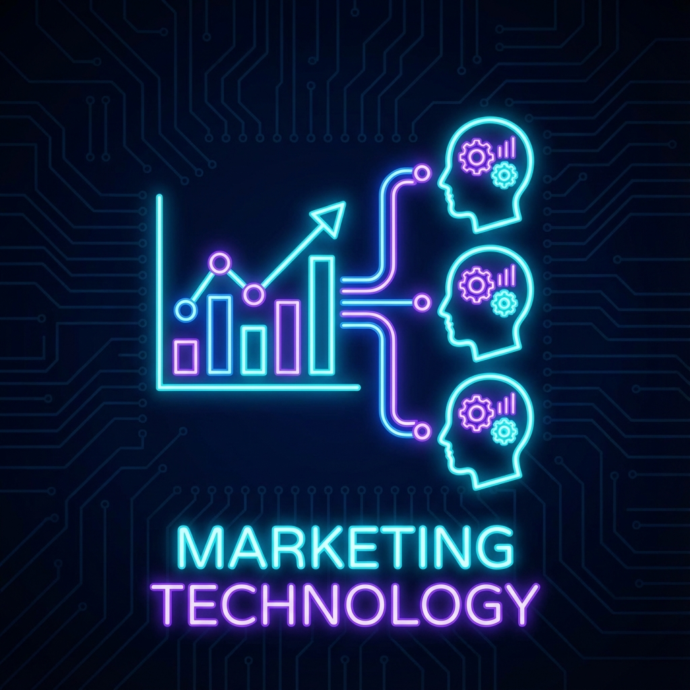

# Professional Service Offering: Marketing Technology (MarTech) Consulting

## Deep Domain Expertise in Affiliate & Partner Marketing Platforms

17 years at ShareASale/Awin Global gave me unparalleled insights into the MarTech landscape. I understand tracking, attribution, payments, and the systems that power partner marketing at scale. I know what breaks at 3 AM when millions in revenue are at stake.

Now I'm applying that expertise—along with modern AI capabilities—to help MarTech companies build, scale, and modernize their platforms.

---

## Current Engagement

**Fractional CTO | Stealth MarTech Startup | 2024-Present**

Providing technical leadership for a stealth-mode MarTech startup focused on partner ecosystem management:
- Shipped beta product to early customers
- Architecture decisions for scalable platform design
- Infrastructure strategy (cloud, deployment, monitoring)
- Code and design review ensuring quality at early stage
- Team enablement and technical mentoring

This active engagement keeps me current with modern MarTech challenges and opportunities.

---

## Domain Expertise

### 17 Years at ShareASale (Acquired by Awin Global)

Built and scaled affiliate marketing infrastructure serving:
- **250,000+** publishers (affiliates)
- **10,000+** merchants (advertisers)
- **$1B+** in annual transaction volume
- **250M+** monthly tracking requests

Led platform through acquisition and multi-year consolidation with UK-based Awin Global, integrating four separate platforms into unified architecture.

### What I Know Deeply

**Affiliate & Partner Marketing:**
- Commission tracking and attribution across channels
- Publisher/merchant relationship management at scale
- Payment processing and invoice systems
- Campaign management and performance optimization
- Fraud detection and traffic quality monitoring

**Tracking Systems:**
- High-volume tracking infrastructure (250M+ monthly requests)
- Cross-device and cross-channel attribution
- Cookie and cookieless tracking strategies
- Server-side tracking implementations
- GDPR/CCPA compliance in tracking systems

**E-Commerce Integration:**
- Platform integrations (Shopify, Magento, BigCommerce, WooCommerce)
- Product feed management and optimization
- Dynamic creative and personalization
- Conversion tracking and order validation
- Return/cancellation handling

**Revenue-Critical Operations:**
- 99.95%+ uptime requirements for transaction processing
- Real-time fraud detection without blocking legitimate conversions
- Financial reconciliation systems processing millions in commissions
- Payment systems with PCI-DSS & SOC 2 compliance requirements
- Crisis response for revenue-impacting incidents

---

## Service Offerings

### 1. Affiliate & Partner Marketing Platform Development

**Situation:** You're building or scaling an affiliate marketing, partner, or influencer platform.

**Our Solution:** Architectural guidance and hands-on development support for core MarTech features:

**Tracking & Attribution:**
- Design scalable tracking infrastructure (millions of requests/day)
- Implement multi-touch attribution models
- Handle cross-device and cross-channel tracking
- Build cookieless tracking strategies
- Ensure GDPR/CCPA compliance

**E-commerce Integration:**
- Build integrations with Shopify, Magento, BigCommerce, WooCommerce
- Handle product feeds and dynamic inventory
- Implement conversion tracking and order validation
- Support returns, cancellations, and order modifications
- Real-time transaction processing

**Communication & Partner Management:**
- Newsletter systems and automated messaging
- CRM-like features for managing partner relationships
- Performance dashboards and reporting
- Partner recruitment and onboarding workflows
- Support ticket systems and communication tools

**Payments & Invoicing:**
- Commission calculation engines with flexible rules
- Payment processing and financial reconciliation
- Invoice generation and tracking
- Tax compliance (1099, W-9) handling
- Multi-currency and international payment support

**Recent Evidence:** Currently architecting partner management platform as Fractional CTO for stealth startup.

### 2. AI-Powered MarTech Innovation

**Situation:** You want to leverage AI to differentiate your MarTech platform but don't know where to start or how to implement responsibly.

**Our Solution:** Strategic AI integration for MarTech use cases with proven implementation capability:

**Intelligent Attribution:**
- AI-powered multi-touch attribution modeling
- Predictive conversion probability scoring
- Anomaly detection for tracking data
- Fraud detection using ML patterns
- Traffic quality scoring and filtering

**Content & Campaign Optimization:**
- AI-generated ad copy and creative suggestions
- Automated A/B testing with reinforcement learning
- Personalized campaign recommendations
- Dynamic product recommendations
- Natural language campaign creation interfaces

**Partner Intelligence:**
- Predictive partner performance scoring
- Automated partner segmentation and targeting
- Churn prediction and intervention
- Natural language search across partner data
- AI-powered partner support chatbots

**Implementation Capabilities:**
- Production RAG systems for knowledge management
- LLM integration (OpenAI, Anthropic, open-source)
- Custom evaluation frameworks for quality measurement
- Edge deployment for low-latency AI features
- Cost optimization for AI-powered features

**Recent Portfolio:** Shipped 4 production RAG systems in one week with measurable quality improvements. [Live demos available](https://vercel-rag-demo.stevenleve.com).

### 3. AdTech & Campaign Management Systems

**Situation:** You need to build or improve your advertising technology, such as internal ad servers, campaign management tools, or video ad platforms.

**Our Solution:** Design and implementation of advertising infrastructure:

**Ad Servers:**
- Internal ad placement scheduling and targeting
- Real-time bidding (RTB) integrations
- Impression tracking and viewability measurement
- Ad rotation and frequency capping
- Performance reporting and analytics

**Campaign Management:**
- Campaign creation and workflow tools
- A/B testing infrastructure
- Budget pacing and optimization
- Multi-channel campaign coordination
- Creative management and versioning

**Video Advertising:**
- Video hosting and streaming infrastructure
- Interactive video ad creation tools
- Player integration and tracking
- View completion tracking
- Engagement analytics

### 4. MarTech Platform Modernization

**Situation:** Your existing MarTech platform is struggling to keep up with the demands of your business. It's slow, unreliable, or difficult to update.

**Our Solution:** Comprehensive platform modernization with minimal customer disruption:

**Assessment & Planning:**
- Audit existing architecture and identify bottlenecks
- Technology stack evaluation and gap analysis
- Migration roadmap with risk assessment
- Stakeholder alignment and communication strategy
- Success metrics and measurement plan

**Execution:**
- Zero-downtime migration strategies
- Microservices decomposition where appropriate
- Cloud migration (AWS, Azure, GCP)
- Performance optimization and scaling
- Technical debt reduction

**Modern Capabilities:**
- API-first architecture for integrations
- Real-time data processing pipelines
- Modern observability (DataDog, CloudWatch)
- CI/CD automation
- Infrastructure as Code (Terraform)

**Proven Track Record:**
- Led zero-downtime AWS migration for ShareASale platform
- Integrated 4 acquired platforms into unified architecture
- Reduced AWS costs 25% while improving reliability
- Achieved 99.95%+ uptime for revenue-critical systems

---

## Why Choose Me?

### Deep MarTech Domain Knowledge

25+ years in marketing technology gives me insights competitors don't have:
- Deep knowledge of agency perspectives and customer insights 
- What works and what breaks at scale
- Common integration pitfalls and how to avoid them
- Fraud patterns and detection strategies
- Payment and financial compliance requirements
- Publisher and merchant expectations

### Full-Stack Capability

I've built everything from tracking pixels to payment systems:
- Frontend UX for publishers and merchants
- Backend APIs and transaction processing
- Content Managment Systems (CMS)
- Customer Relationship Management (DRM) and Support Systems (ZenDesk) 
- Database design and optimization (massive SQL expertise)
- Infrastructure and cloud architecture
- Integration with third-party platforms
- Comprehensive compliant and scalable email marketing systems 

### Revenue Focus

In MarTech, every click and conversion counts. I design systems that are:
- **Reliable** — 99.95%+ uptime, no dropped conversions
- **Accurate** — Precise attribution, correct commission calculations
- **Secure** — Financial data protection, fraud prevention
- **Scalable** — Handle growth without degradation
- **Observable** — Know when something breaks before customers do
- **Responsive** — smart systems provide business intelligence at scale in real time 

### AI + MarTech Combination

Unique combination of:
- Deep MarTech domain expertise (25 years)
- Production AI implementation capability (recent portfolio)
- AWS AI Practitioner certification
- Understanding of when AI adds value vs. when it's hype

### Crisis-Tested

I've handled:
- Stabilization of undocumented systems under constraint
- Payment processing failures affecting millions in commissions
- Tracking outages during peak shopping seasons
- Catastrophic multi-system failures
- Security incidents requiring immediate action
- Acquisition integrations under tight deadlines

### Current & Relevant

Active fractional CTO work with MarTech startup keeps me engaged with modern challenges:
- Modern cloud architecture patterns
- Current integration APIs and standards
- Privacy regulation compliance (GDPR, CCPA)
- Contemporary fraud patterns
- Emerging AI opportunities

---

## Technical Capabilities

### MarTech-Specific Technologies

**Tracking & Attribution:**
- Cookie and cookieless tracking strategies
- Server-side tracking implementations
- Multi-touch attribution modeling
- Cross-device identity resolution
- GDPR/CCPA compliant tracking

**E-Commerce Platforms:**
- Shopify, Magento, BigCommerce, WooCommerce
- Custom cart integrations
- Product feed processing and optimization
- Order webhooks and APIs
- Inventory synchronization

**Payment Processing:**
- ACH, wire transfer, PayPal integrations
- Multi-currency payment handling
- 1099 and tax compliance automation
- Commission calculation engines
- Financial reconciliation systems

**APIs & Integrations:**
- RESTful API design and implementation
- Webhook systems for real-time updates
- OAuth and API authentication
- Rate limiting and abuse prevention
- Third-party platform integrations

### Infrastructure & Operations

**Cloud Platforms:**
- AWS (primary expertise: EC2, RDS, Lambda, SQS, CloudWatch)
- Cloudflare (Workers, Vectorize, D1, R2)
- Experience with Azure and GCP patterns

**Databases:**
- SQL Server (expert level, 25+ years)
- PostgreSQL (including pgvector for AI applications)
- MySql, SQLite, DuckDB
- NoSQL where appropriate (DynamoDB, DocumentDB, Mongo)
- Data modeling for high-volume transactional systems

**Observability:**
- DataDog (monitoring, logging, APM)
- AWS CloudWatch
- New Relic, LogicMonitor, LanSweeper, PRTG
- Custom metrics and alerting
- Incident response and postmortem culture

**AI/ML Technologies:**
- LLM integration (OpenAI, Anthropic, open-source)
- Vector databases (pgvector, Cloudflare Vectorize)
- RAG architectures and optimization
- Custom evaluation frameworks
- Edge AI deployment (Cloudflare Workers AI)

---

## Engagement Models

### 1. Fractional CTO / Technical Advisor

**Time:** 10-20 hours/week  
**Duration:** 3-12 months  
**Best For:** Startups needing senior leadership before full-time hire  

**Services:**
- Architecture decisions and technology strategy
- Code and design review
- Infrastructure and security guidance
- Team mentoring and hiring support
- Board/investor communication on technology

**Pricing:** $5,000 - $10,000/month

### 2. Feature Development (Project-Based)

**Duration:** 4-12 weeks typically  
**Best For:** Specific features or integrations  

**Examples:**
- Build Shopify integration with conversion tracking
- Implement AI-powered campaign optimization
- Create partner intelligence dashboard
- Build fraud detection system
- Develop payment processing workflow

**Pricing:** $15,000 - $50,000 depending on scope

### 3. Platform Modernization

**Duration:** 3-9 months  
**Best For:** Legacy platform updates or technology migrations  

**Services:**
- Assessment and roadmap development
- Architecture redesign
- Phased migration execution
- Team enablement and training
- Performance optimization

**Pricing:** $30,000 - $150,000 depending on scope

### 4. Consulting / Advisory

**Time:** 5-10 hours/week  
**Duration:** 1-3 months  
**Best For:** Strategic decisions, architecture review  

**Services:**
- Technology stack evaluation
- Build vs. buy recommendations
- Architecture review and optimization
- M&A technical due diligence
- AI opportunity assessment

**Pricing:** $3,000 - $5,000/month

---

## Ideal Client Profile

**You're a good fit if:**
- You're building or operating affiliate, partner, or influencer platforms
- You need someone who understands MarTech deeply, not just generic engineering
- Revenue and reliability are critical (no room for "move fast and break things")
- You want to explore AI opportunities but need practical, proven implementation
- You value strategic thinking backed by hands-on capability

**You might not be a good fit if:**
- You need expertise in display advertising networks or programmatic
- Your focus is social media advertising platforms
- You're looking for marketing strategy consulting (not technical)
- You need full-time commitment immediately (though I'm open to discussing)

---

## Case Studies (Brief)

### Platform Consolidation (ShareASale + Awin Integration)

**Challenge:** Integrate four acquired platforms (ShareASale, affilinet, zanox, awin) into unified architecture post-acquisition.

**Solution:** 
- Multi-year roadmap prioritizing revenue protection
- Phased migration with zero customer-facing downtime
- Cross-timezone stakeholder alignment (US, UK, Germany)
- Legacy integration maintenance during transition

**Results:**
- 99.5% revenue protection during consolidation
- Zero merchant-facing downtime across critical migrations
- Successful cultural integration across engineering teams

### Zero-Downtime AWS Migration

**Challenge:** Migrate on-premise data center to AWS without impacting $1B+ annual transaction volume.

**Solution:**
- Parallel run strategy with gradual traffic shift
- Comprehensive observability before migration
- Automated rollback capabilities
- Extensive testing and validation

**Results:**
- Zero customer-impacting downtime
- 25% cost reduction through architecture optimization
- Improved disaster recovery (24-minute RTO demonstrated)

### Tracking Integration Redesign

**Challenge:** Legacy tracking infrastructure causing 30% error rate in merchant integrations.

**Solution:**
- Complete redesign of tracking SDK and API
- New validation and testing frameworks
- Comprehensive documentation and support tools
- Merchant migration program

**Results:**
- 75% error rate reduction (30% → <7%)
- 263ms average latency improvement
- Significant reduction in support tickets
- Faster merchant onboarding

---

## Get Started

Need MarTech expertise that understands both the domain and the technology? Let's talk.

**Contact:** [Get in Touch](https://stevenleve.com/contact/) · [LinkedIn](https://linkedin.com/in/steve-leve)

**Portfolio:**
- 25 years in Marketing Technology with 17 years at ShareASale/Awin Global
- Current fractional CTO for MarTech startup
- [AI Application Portfolio](https://vercel-rag-demo.stevenleve.com) (relevant for AI-powered features)

---

**Note:** I'm also open to full-time roles in MarTech for the right opportunity. If you're hiring and this resonates, let's have that conversation.

**Last Updated:** December 2025
